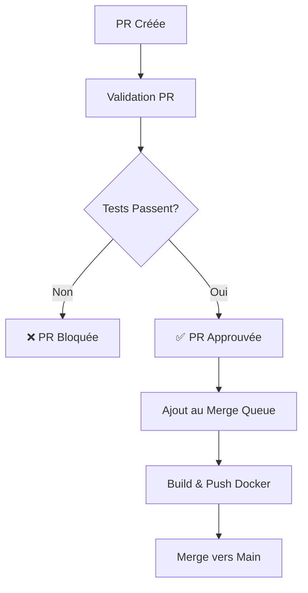

# Guide de Configuration - POC Cache avec Merge Groups

## Vue d'ensemble

Ce POC démontre comment configurer un système de cache Docker optimisé qui ne build et push des images que pendant les merge groups, optimisant ainsi les ressources CI/CD.

## Architecture du Cache

### 1. Stratégies de Cache Utilisées

#### Docker Layer Caching

- **Ordre optimisé**: Les fichiers `package*.json` sont copiés avant le code source
- **Multi-stage builds**: Séparation des dépendances, build, et runtime
- **Cache GitHub Actions**: Utilisation de `type=gha` pour persister le cache entre builds

#### Registry Cache

- **Cache mount**: Utilisation de `--cache-from` et `--cache-to`
- **Cache partagé**: Le cache est partagé entre tous les builds du repository

### 2. Workflow de Build



## Configuration Requise

### 1. Repository Settings

#### Branch Protection Rules (main)

```yaml
Protect matching branches: true
Require a pull request before merging: true
  - Require approvals: 1
  - Dismiss stale PR approvals when new commits are pushed: true
Require status checks before merging: true
  - Require branches to be up to date before merging: true
  - Status checks required:
    - "CI/CD Pipeline avec Cache Optimisé / test"
    - "PR Validation / validate"
Require merge queue: true ⭐ IMPORTANT
Restrict pushes: true
```

#### Merge Queue Settings

```yaml
Maximum number of pull requests to build: 5
Minimum number of pull requests to build in a group: 2
Wait time before building (minutes): 5
Only build pull requests individually if necessary: false
```

### 2. Secrets Required

#### Pour GitHub Container Registry (GHCR)

Aucun secret supplémentaire requis - utilise `GITHUB_TOKEN` automatique.

#### Pour Docker Hub (optionnel)

```yaml
DOCKER_USERNAME: votre-username-docker-hub
DOCKER_TOKEN: votre-access-token-docker-hub
```

### 3. Permissions Required

Le workflow nécessite ces permissions :

- `contents: read` - Pour checkout du code
- `packages: write` - Pour push vers GHCR
- `security-events: write` - Pour le scan de sécurité (optionnel)

## Optimisations de Performance

### 1. Cache Layers Docker

Le `Dockerfile` utilise plusieurs techniques d'optimisation :

```dockerfile
# ✅ BONNE PRATIQUE: Copier package*.json en premier
COPY package*.json ./
RUN npm ci --only=production

# ✅ BONNE PRATIQUE: Copier le code source après
COPY src/ ./src/
```

### 2. Cache GitHub Actions

```yaml
cache-from: |
  type=gha                    # Cache GitHub Actions (rapide)
  type=registry,ref=...       # Cache Registry (partagé)
cache-to: |
  type=gha,mode=max          # Sauvegarde complète
  type=registry,ref=...,mode=max
```

### 3. Mesures de Performance Attendues

- **1er build**: ~3-5 minutes (aucun cache)
- **Builds suivants**: ~30-90 secondes (avec cache)
- **Réduction du trafic**: 70-80% moins de données transférées

## Workflow de Développement

### 1. Développement Local

```bash
# Clone du repository
git clone <repo-url>
cd cache-test

# Installation des dépendances
npm install

# Développement
npm run dev

# Tests
npm test
```

### 2. Création d'une PR

```bash
# Créer une branche
git checkout -b feature/nouvelle-fonctionnalite

# Développer et committer
git add .
git commit -m "feat: nouvelle fonctionnalité"
git push origin feature/nouvelle-fonctionnalite

# Créer la PR via GitHub UI
```

### 3. Process d'Approbation

1. **PR créée** → Validation automatique (tests, lint, build check)
2. **Review** → Approbation manuelle requise
3. **Merge Queue** → Build et push automatique de l'image Docker
4. **Merge** → Déploiement de l'image

## Monitoring et Debug

### 1. Vérification du Cache

```bash
# Vérifier les layers de cache
docker buildx imagetools inspect ghcr.io/pfrances-poc/cache:buildcache

# Analyser l'utilisation du cache
docker build --progress=plain .
```

### 2. Debug des Workflows

- Consulter les logs GitHub Actions
- Vérifier les statuts des checks
- Examiner le merge queue dashboard

### 3. Métriques à Suivre

- Temps de build (avec/sans cache)
- Taille des images
- Fréquence d'utilisation du cache
- Temps d'attente dans la merge queue

## Troubleshooting

### Problème: Cache non utilisé

**Solution**: Vérifier que les layers Docker sont dans le bon ordre

### Problème: Merge queue bloquée

**Solution**: Vérifier les status checks requis et les permissions

### Problème: Build échoue seulement en merge group

**Solution**: Tester localement avec les mêmes build args

## Évolutions Possibles

1. **Cache distributé** avec Redis ou Memcached
2. **Build multi-architecture** (ARM64 + AMD64)
3. **Déploiement automatique** après merge
4. **Monitoring avancé** avec Prometheus/Grafana
